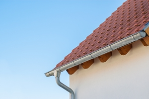

What benefit do you think of when you consider your [**gutters**](https://www.novagutter.com/residential-gutter-installation-boca-raton-fl.php) -- if you even consider them at all? Perhaps you think they're a great way to keep your Boca Raton home's porch from turning into a waterfall when the rain comes down in sheets. Certainly, your gutters provide that benefit, but that's not the only benefit they provide.

After all, your gutters actually perform many other great protective benefits for your Boca Raton home. Those benefits are vital for maintaining the well-being of your home, and knowing them, you will understand why it's important to stay on top of your gutters' maintenance needs.

Should your gutters need any kind of maintenance or upkeep, then look to the [**Boca Raton gutter pros**](https://www.novagutter.com/) at **Nova Gutter Corporation**. We have the expertise to provide the gutter work you need to continue enjoying all of the great protective benefits your gutters can provide:

## They Prevent Foundational Damage

When you consider the kinds of damage that water can cause, you might consider only wood rot and mold development. While those issues can certainly develop because of water, another, perhaps more immediately endangering problem can also occur: foundational damage.

This damage could occur if rainwater were able to fall straight from your roof to the base of your Boca Raton home, where it could cause foundational cracks. Luckily, you can avoid this dangerous issue (that can be quite costly to address) by maintaining your gutters.

## They Help Avoid Wood Rot

Of course, the above-mentioned issue of wood rot is still nothing to look lightly at, even in the light of potential foundational issues. If your home's siding is made of wood, then it could begin to rot and weaken if it were to remain exposed to a heavy amount of rainwater.

Luckily, you can avoid this rot by ensuring that rainwater is not able to run unabated down the side of your home. To be sure you avoid this issue, you need to maintain your gutters. By working properly and consistently, your gutters will help protect your home's exterior wooden structures so they can avoid rot and stand strong.

## They Maintain Your Home's Curb Appeal

Your home should maintain strong curb appeal. This curb appeal will help you keep up your home's resale value, attract buyers when you're ready to sell, and maintain a good appearance in your neighborhood. Of course, if rainwater were to fall down your Boca Raton home's siding, your home could experience discoloration and stains that could affect its curb appeal.

To best maintain your home's curb appeal, you need to protect your home from the issues of discoloration and staining. You can protect your home from these issues by keeping your gutters in quality condition. With gutters that will prevent your home's exterior from going to pot, you can maintain its curb appeal and enjoy all the great benefits that curb appeal provides.