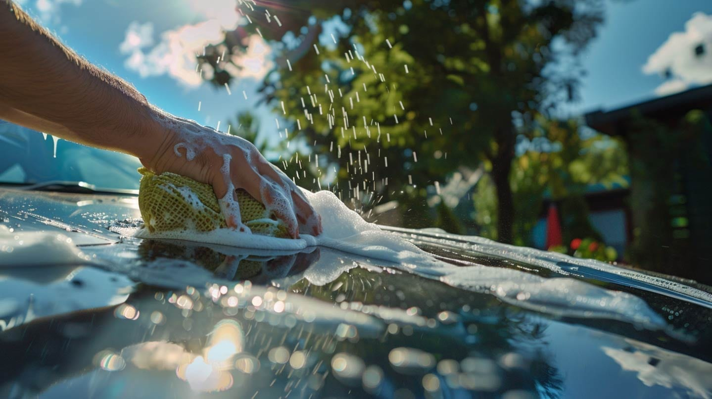



# Website Design in Utah County
Some supporting copy for this 
{.text-white}



## Utah’s Friendly Web & SEO Team
We grow local businesses with fast, beautiful sites.





## New sectionNew 





  





## This is an H2 heading 
{.center}


{.center}

This is another test
{.center}

### This is an H3

Numbered list
1. One is the **bolb** way
2. Two is the [link](/test/) test
3. Inline button?   is the way? 
4. Three



How about simple **bold** text

what is [going]("https://rankutah.com") on?



- This is some markdown
- Another list
- And again



## Default section
Body copy uses the page’s `.prose` styles. This only sets width/padding.
1. This is another type of content
2. And another



## Centered block

Everything inside is centered, but Typography remains unchanged.

This is a nother thing of text. Common to the end. 







    
  ## A title

  Some text…
  
  { .rounded-xl}
  
  
  
  ## Another major text
  More text...
  
  
  
  ## This is what needs to happen
  When you need to do this, do it
  
  
  
  {.center}
  

  
  ## This is what needs to happen 

  List of things

  1. one
  2. two
  3. three
  
  When you need to do this, do it
  {.text-center} 
  
  
  
  {.text-center}

  









  
  ## Carded tile
  This tile uses your site’s card style.
  
  
  

  
  ## Plain tile
  This one is not a card. It just renders your Markdown normally.
  

  
  ## Linked card
  Clicking anywhere in this card goes to **/services/**.
  







## A heading outside the grid
This should render as Markdown, **bold**, *italics*, links, etc.



  
  ### Carded tile
  A paragraph in a card.
  
  

  
  ### Plain tile
  Just Markdown in a normal tile.
  



More **Markdown** below the grid should render too.


