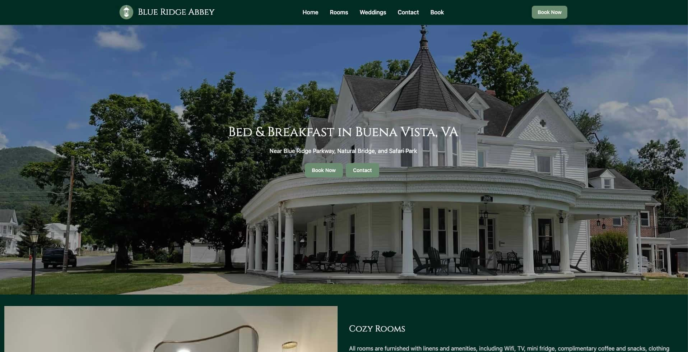

# Website Design
Completely custom websites. Built for performance.

Build a fast website that turns visits into calls and form fills. Clear messaging, strong visuals, and lightweight code designed to perform on mobile.




## Why choose this approach

- Loads fast on mobile and Core Web Vitals–friendly
- Clear, conversion‑focused page structure and copy
- Lightweight, custom build—no bloated templates
- Easy updates and ongoing support
- Analytics and call tracking ready

## Featured work





### Quartz Worx – Countertops





### Cedar City Strength – Fitness









### Blue Ridge Abbey – Hospitality





### BlueridgeTech – IT Services







## What clients are saying



## What you get

- Custom design and build (no templates)
- On‑page SEO setup (titles, meta, schema, internal links)
- Performance optimization and image handling
- Forms, spam protection, analytics
- Hosting/CDN and SSL included
- Accessibility and mobile‑first best practices
- Training and friendly support

## How it works

1. Discovery — goals, audience, and sitemap
2. Design — content structure, look & feel, and copy guidance
3. Build — fast, accessible pages with no bloat
4. Launch — tracking, QA, and go‑live checklist
5. Grow — updates, pages, and reporting as you scale

## Step 1: Pick your colors



## Step 2: Save your colors

Save your colors by sending a quick message.




## Step 3:

Decide whether you also need  and then choose your 

## Locations

Clear Presence provides website design and local SEO services for businesses across the United States with an office in Pleasant Grove, UT. Here are a few locations where clients are located.

[Pleasant Grove](/locations/pleasant-grove-ut) • [Buena Vista](/locations/buena-vista-va) • [Grand Junction](/locations/grand-junction-co) • [Boca Raton](/locations/boca-raton-fl) • [All Locations](/locations)

## Ready to get started?




