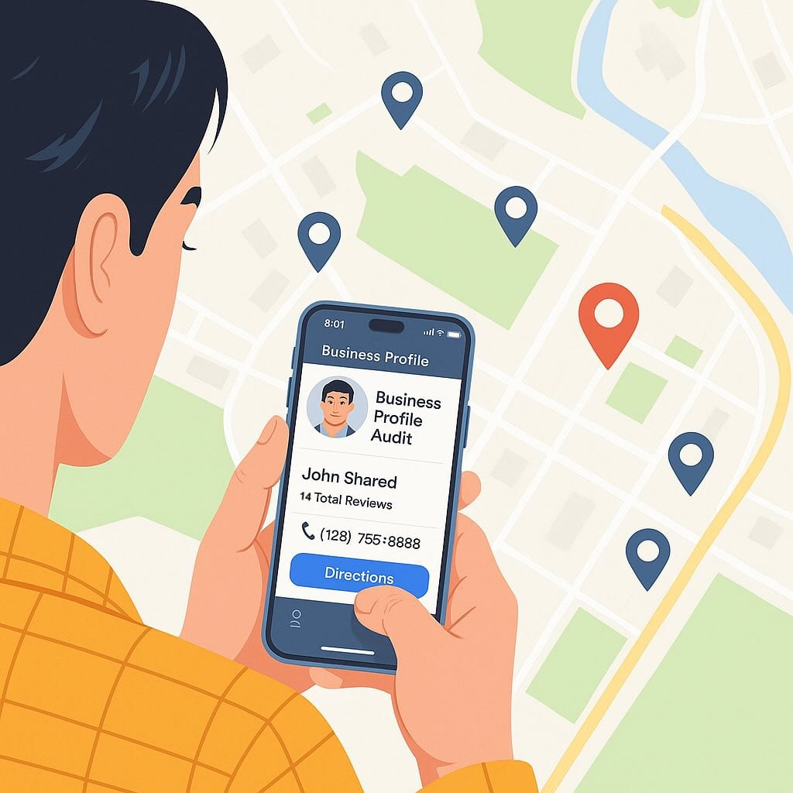

Your Google Business Profile (GBP) is one of your most powerful tools for finding local customers in Utah. But with a few simple adjustments, you could be getting even more calls and new business. This free, no-obligation review is a simple 30-minute video chat where we'll work together to optimize your profile. 

If you are in a rush and ready to go you can [schedule here](https://calendly.com/rankutah/30min). 

## What You'll Get in Your Free Google Business Profile Review

During your 30-minute review, we'll compare your Google Business Profile to your competitors and focus on the areas that matter most.
- Primary and Additional Categories (The #1 ranking factor: how to select)
- Reviews (How to get more and what to do with the ones you have)
- Website URL (Using the right page and getting better analytics)
- Description (Improving your click-through rates)
- Photos & Videos (Optimizing for visibility)
- Address (landing page per location)
- Business Hours  (Understanding the impact on visibility)
- Products & Services (Improving profile engagement)
- Posts and Social Media Links (Ongoing promotional post ad)
- Q&A (Adding your own Q&A)
- Service Areas (Showing your service area)

## Why a Strong Google Profile Equals More Calls

About [75% of people](https://www.statista.com/statistics/1260363/consumers-using-search-engines-to-find-local-business-info/) use Google to find local business information. When someone searches for a service, Google shows a map with the top profiles in that area. These also appear in Google Maps, where many customers start their search. A well-optimized profile helps you show up and get more calls. 

## Why Trust me to Perform this Review

Your review is based on the latest insights from [Whitespark's local search ranking factors](https://whitespark.ca/local-search-ranking-factors), along with research from top SEO publications and podcasts. You can browse my blog to learn more about my SEO approach and experience. A few reviews from my own business are shown below. 

<!-- Elfsight Google Reviews | Rank Utah -->

## Why is This Free?

I offer this free service to help local businesses get a quick win and to introduce you to my SEO work. There's no pressure to start services, but if you find it helpful, you're welcome to leave a review or [start local SEO services or Web Design services](https://rankutah.com) to boost your visibility. 

## How do I sign up for my free 30-Minute Review? 

Schedule your [free 30-minute Google Business Profile Review here](https://calendly.com/rankutah/30min). If you have additional questions you can call or text me at 801-980-2202. For more information on my business or services visit [RankUtah.com](https://rankutah.com)